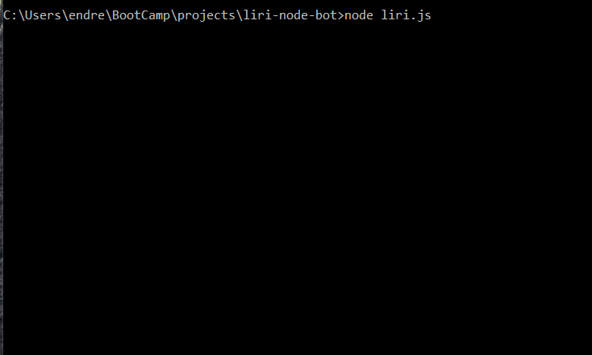
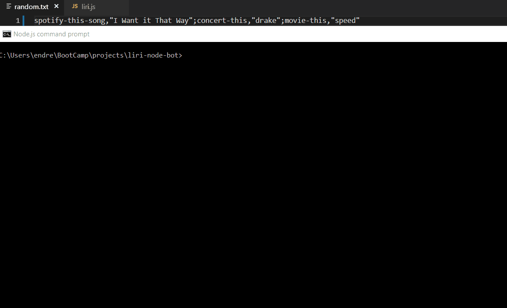

# LIRI Bot

## Description
LIRI Bot is a node.js command line application that allows users to retrieve information about upcoming concerts, and preview songs and movies.

## Motivation 
LIRI Bot is designed for the spartan minimalist who prefers to consume information in plain text from a terminal. One can get only what they need and nothing more, such as finding concert information about their favorite artists, and reading the clever plot from the movie 'Speed'.

### Installation
```
git clone <SSH or HTTPS link for LIRI Bot repository>
cd path/to/liri-node-bot/
npm install
touch .env
```
You will need a Spotify developer account. In the .env file, add the following Spotify information:
```
SPOTIFY_ID=<your-spotify-id>
SPOTIFY_SECRET=<your-spotify-secret>
```

### Results
Users enter a command and additional arguments via the command line. API calls using the Ajax and Spotify npm modules retrieve information and display it to the console. If the command and additional arguments are valid (eg. the given movie name exists), they are saved to a text file as logging information.

### Commands
LIRI Bot can be run using one of four commands:
1. Displays upcoming concerts for the given artist:
```
node liri.js concert-this <artist/band name here>
```
2. Displays infomation about songs matching the provided song name. Includes a Spotify link to the song preview:
```
node liri.js spotify-this-song <song name here>
```
3. Displays information about a given movie such as title, Rotten Tomatoes rating, and actors:
```
node liri.js movie-this <movie name here>
```
4. Retrieves a random command and additional arguments pair from the included text file, parses them, and pases them to LIRI Bot:
```
node liri.js do-what-it-says
```

### Examples
#### concert-this 


#### spotify-this-song


#### movie-this


#### do-what-it-says
